# Iris - Serverless Analytics

## Setup Executors
Here is a quick guide on how to set up the prototype.
### AWS Lambda
First set up your Lambda function. We will set up a filter function where it takes `function` and `range` as parameter. The S3 bucket will be hardcoded in the Lambda function.

First create a Lambda function
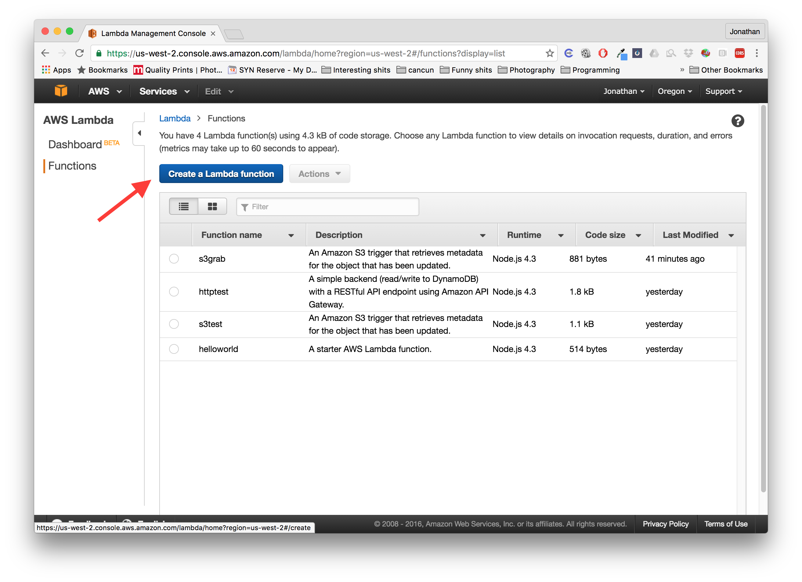

Do not add any triggers and just click next. We will add the API gateway trigger next which will host our REST API.
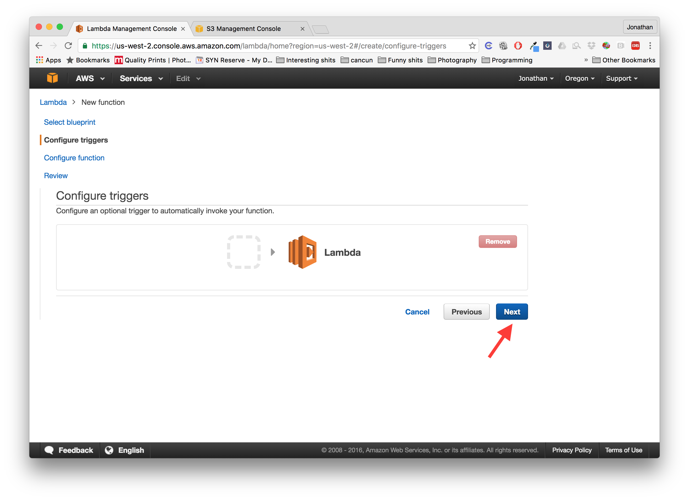

Give your function a name and description.
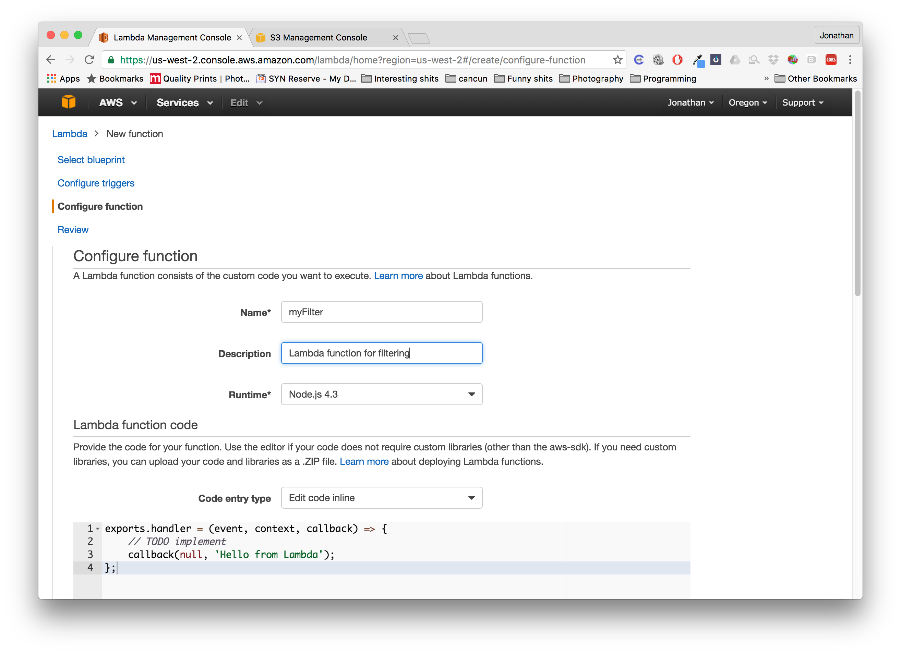

Copy paste the code in `lambda/filter.js` to code box like so. Make sure to replace `cs499rbucket` to a S3 bucket that you own and have access to. Also replace `tweet` for your own key.
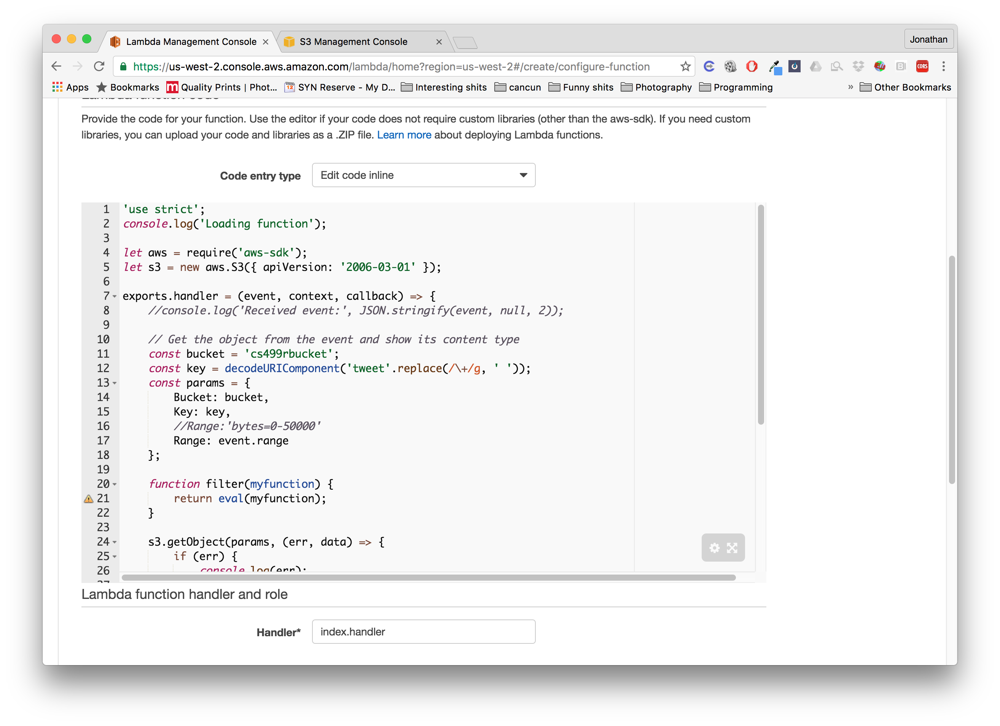

Add a role, which determines who has permissions to use your function.
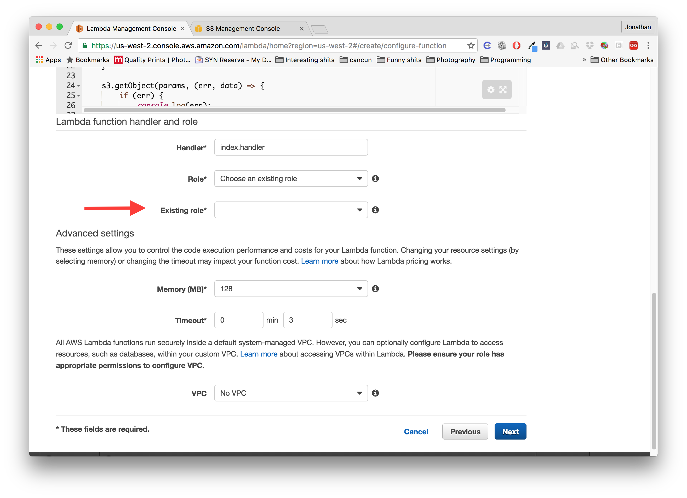

Next you will create a API Gateway so we can access it using a HTTP requests.


### Amazon API Gateway

Create a new API.
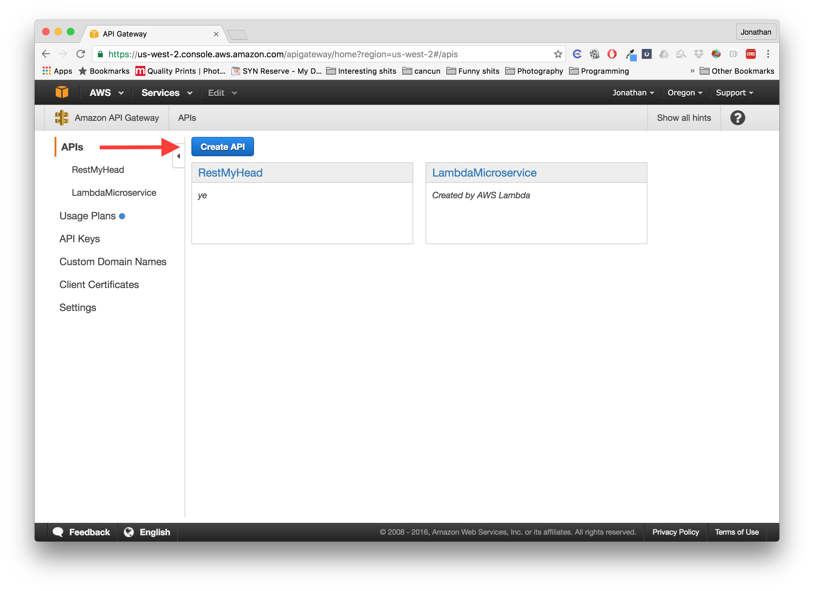

Name your API
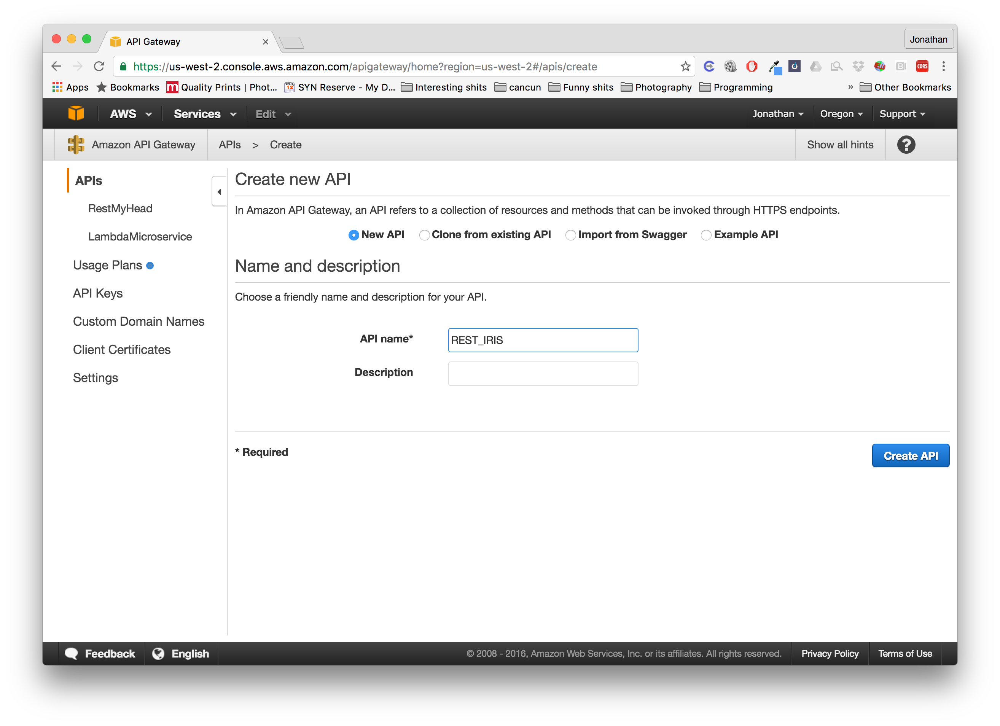

Click **Actions > Create Method**
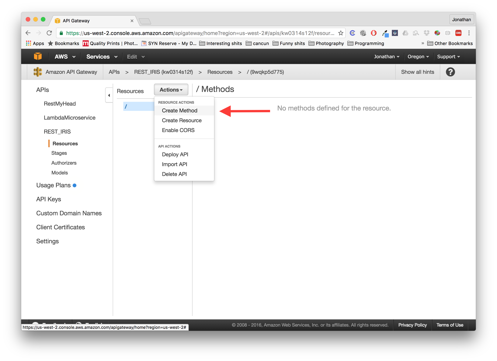

Make it a **POST** method and choose the **Integration Type** to be **Lambda Function**.
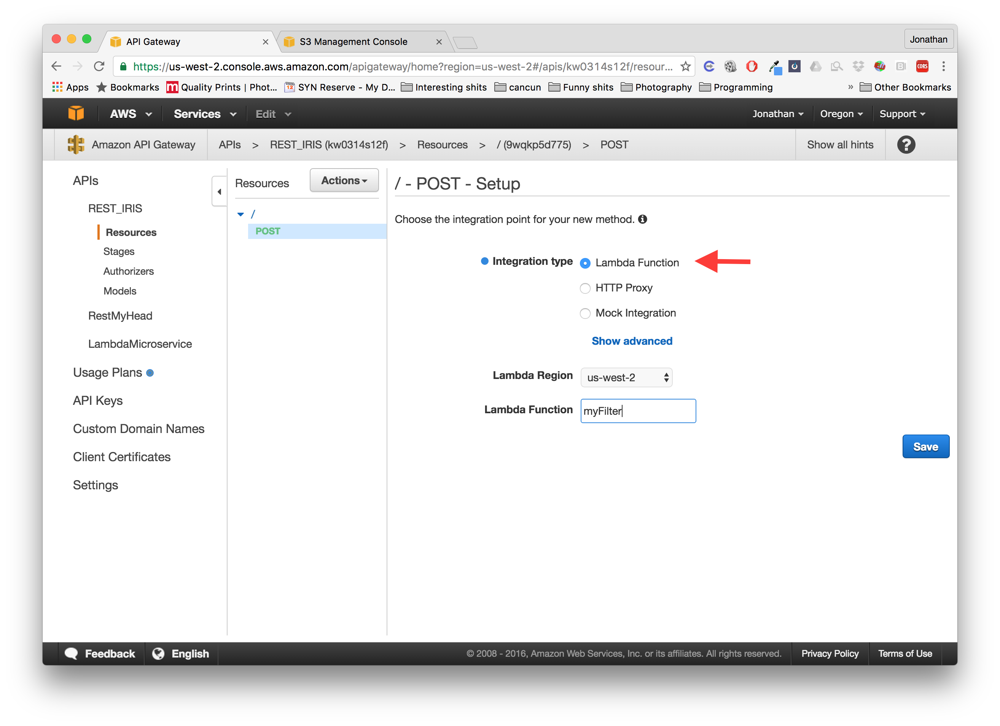

Deploy your API by clicking **Actions > Deploy API**
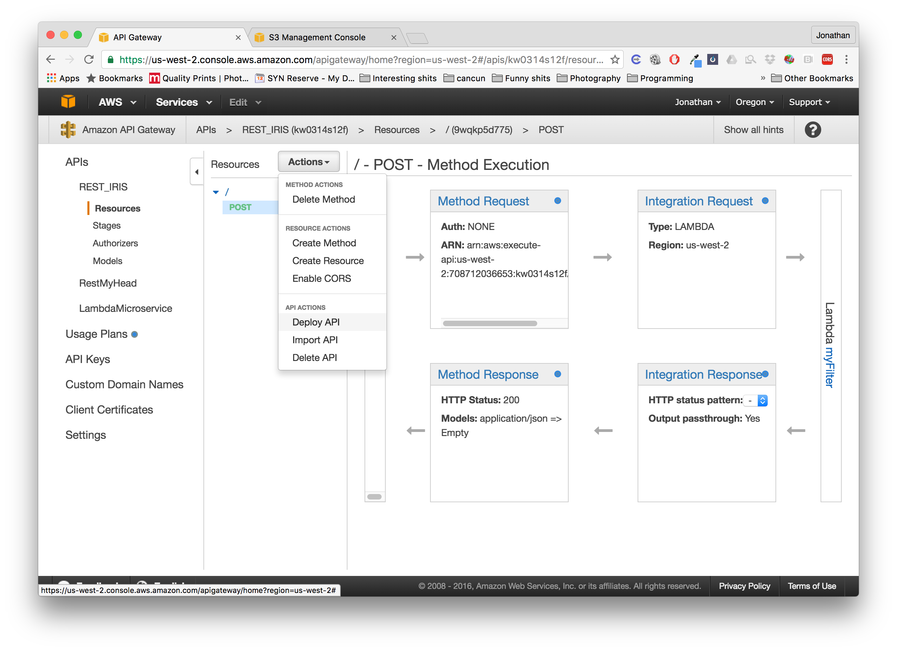

Give it a Deployment Stage.
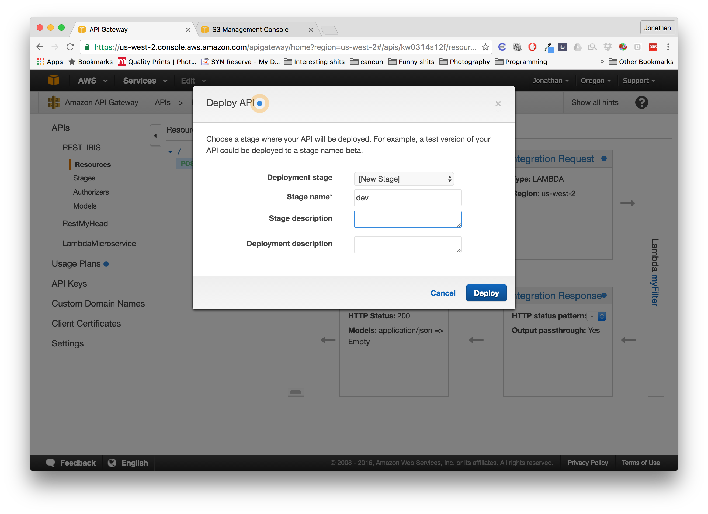

Copy the URL which you will use to invoke your REST API requests.
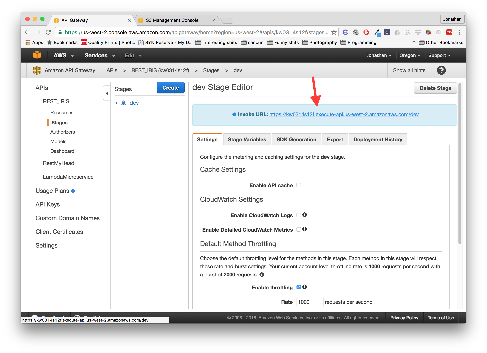

### Test your requests

Using the CURL program of your choice. Send a POST request to that URL you had and add a JSON string to your body where `function` is the filter function you want and `range` is the range of bytes you want to read from the S3.
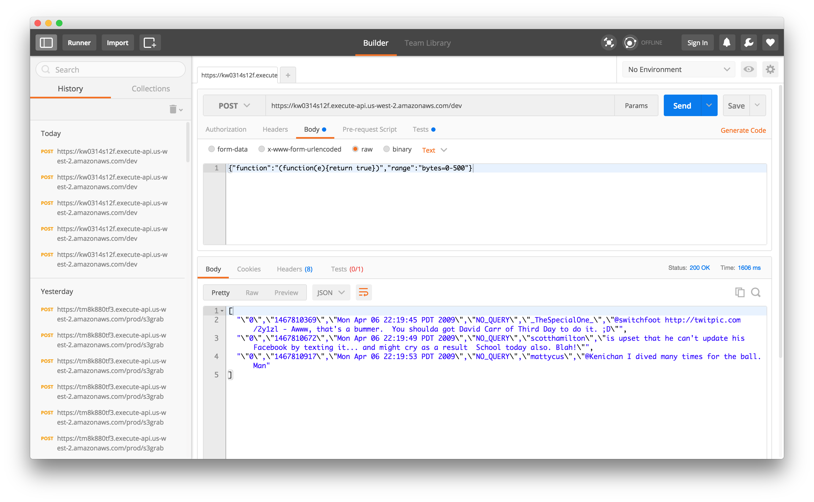

## Setup WebApp and Master Node

This master node breaks down the request into pieces if the source file is too large for one executioner to manage. It will also host a web page and a WebSocket server so that we have an interface to test our code.

On the terminal run the following commands:
```
> cd webapp/
> npm install
> node server.js
```

Then the web page should look something like this:
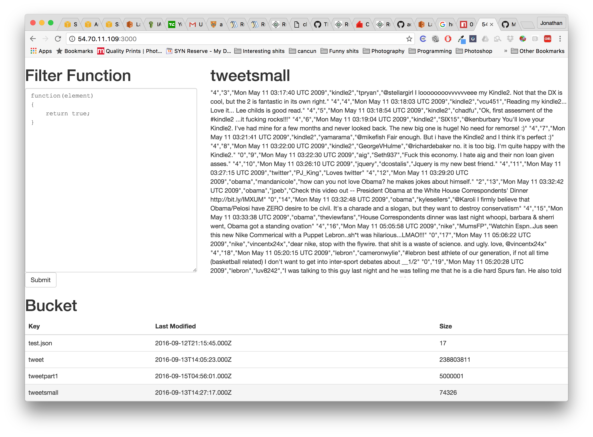

## Design
